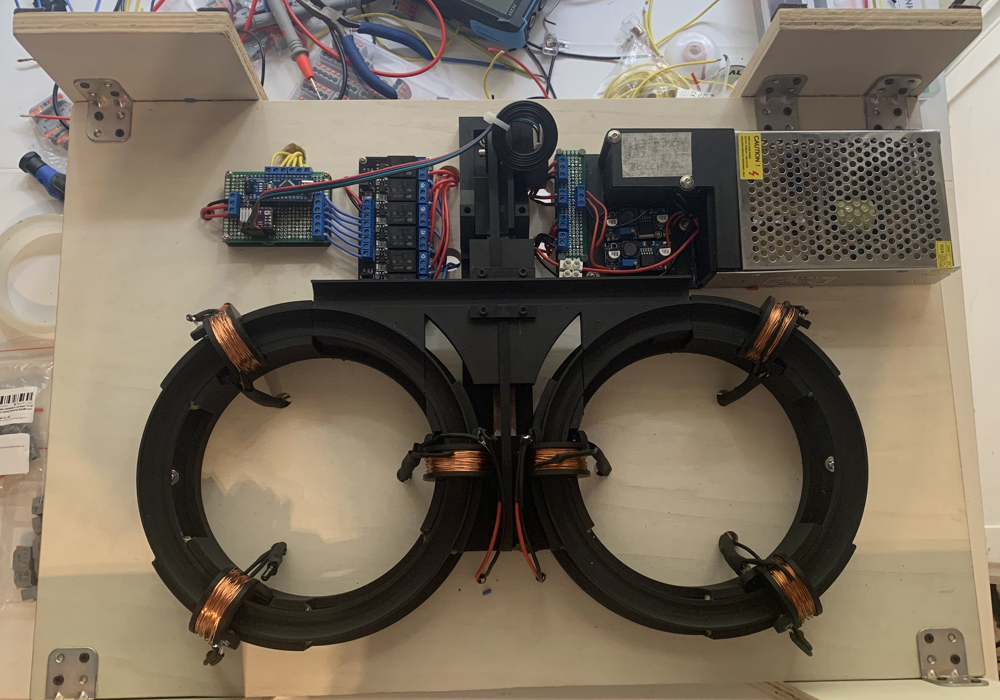
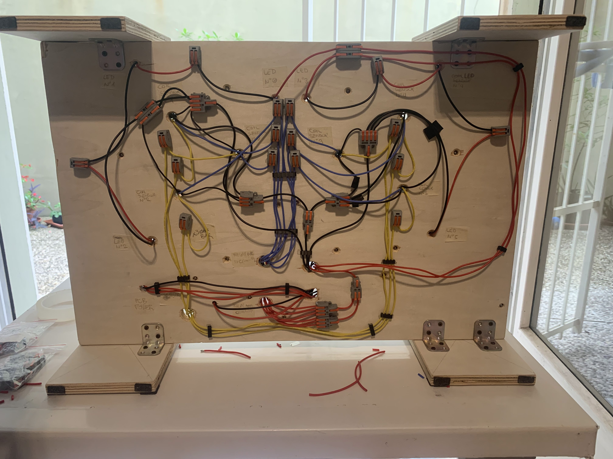

# Particle Accelerator
This project is intended as a small, semi-automated demonstration of a particle collider.

It uses pulsating magnetic coils to accelerate steel balls, then collides them.

## Pictures

